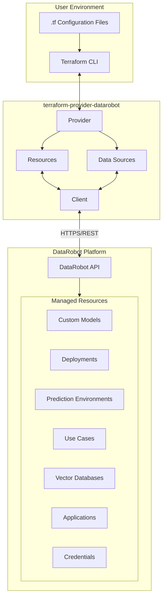
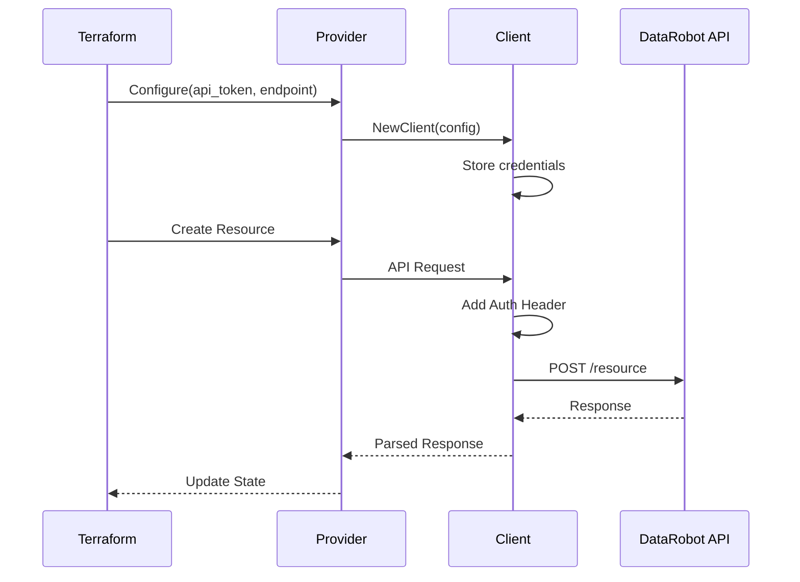

# Terraform Provider DataRobot - Architecture

## Overview

This Terraform provider enables infrastructure-as-code management of DataRobot resources.

## Architecture Diagram



## Component Description

### Provider Layer (`pkg/provider/`)
- **provider.go**: Main provider configuration, authentication setup
- **\*_resource.go**: Individual resource implementations (CRUD operations)
- **\*_data_source.go**: Data source implementations (read-only)

### Client Layer (`internal/client/`)
- **client.go**: HTTP client with retry logic, authentication
- **service.go**: Service interface defining all API operations
- **\*_service.go**: Service implementations for each resource type

### Data Flow

1. User writes Terraform configuration (`.tf` files)
2. `terraform plan/apply` invokes the provider
3. Provider translates Terraform operations to API calls
4. Client handles HTTP communication with DataRobot API
5. Responses are mapped back to Terraform state

## Authentication



## Resource Lifecycle

| Operation | Terraform Command | Provider Method | API Call |
|-----------|------------------|-----------------|----------|
| Create | `terraform apply` (new) | `Create()` | POST |
| Read | `terraform plan/refresh` | `Read()` | GET |
| Update | `terraform apply` (changed) | `Update()` | PATCH/PUT |
| Delete | `terraform destroy` | `Delete()` | DELETE |
| Import | `terraform import` | `ImportState()` | GET |

## Directory Structure

```
terraform-provider-datarobot/
├── internal/
│   └── client/           # API client implementation
│       ├── client.go     # HTTP client
│       ├── service.go    # Service interface
│       └── *_service.go  # Resource-specific services
├── pkg/
│   └── provider/         # Terraform provider
│       ├── provider.go   # Provider definition
│       ├── *_resource.go # Resource implementations
│       └── *_test.go     # Tests
├── docs/                 # Generated documentation
├── examples/             # Example configurations
└── mock/                 # Mock implementations for testing
```
